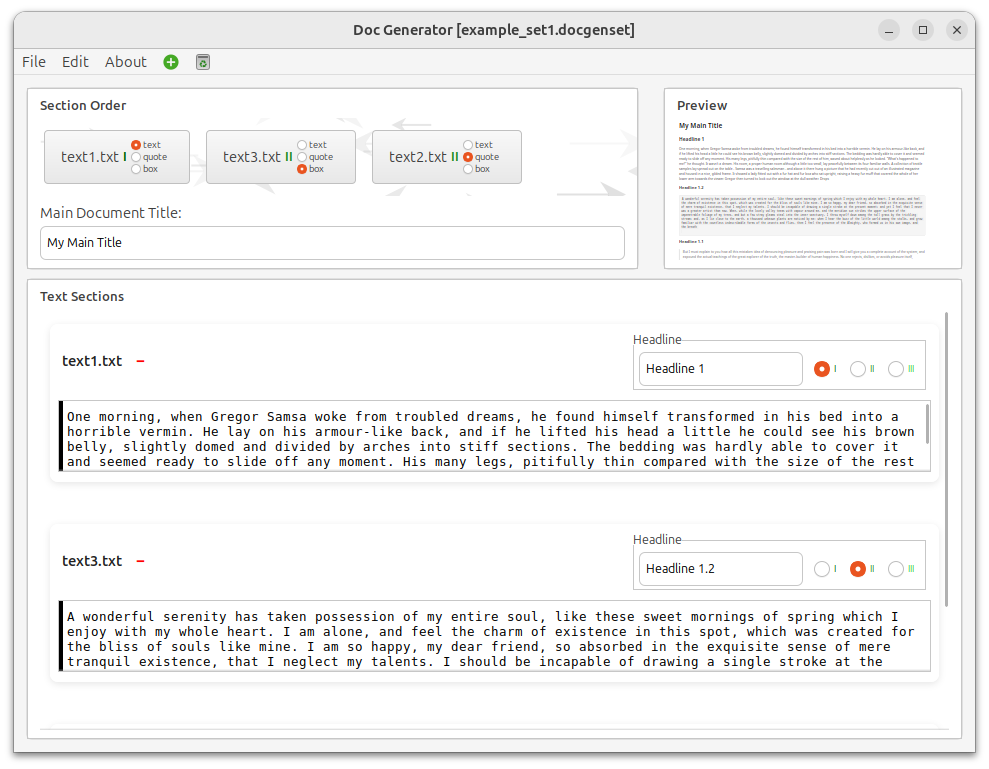
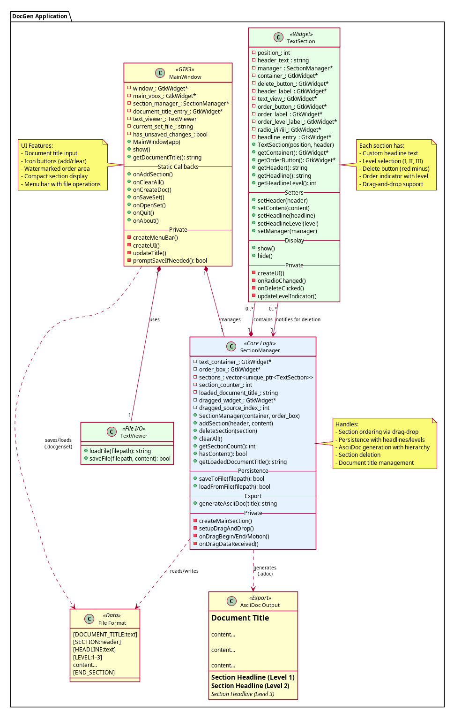

# DocGen - Document Generator

A GTK3-based document management application for creating and organizing text sections with drag-and-drop reordering and AsciiDoc export.



## Features

- **Section Management**: Create and manage multiple text sections with custom headers
- **Customizable Headlines**: Each section has its own headline with 3 configurable levels (I, II, III)
- **Document Title**: Set a main document title for your generated documents
- **Drag-and-Drop Reordering**: Intuitive section reordering with real-time visual feedback
- **Section Deletion**: Remove individual sections with red minus button
- **Set Persistence**: Save and load section sets (`.docgenset` format) with all content, headlines, and levels
- **AsciiDoc Export**: Generate professional AsciiDoc documents with proper heading hierarchy
- **Visual Watermark**: Background watermark in section order area for visual appeal
- **Clean UI**: Modern GTK3 interface with CSS styling and compact design

## Building

```bash
mkdir -p build
cd build
cmake ..
make -j$(nproc)
```

## Running

```bash
cd build
./docgen
```

## Usage

1. **Set Document Title**: Enter the main document title in the "Main Document Title" field
2. **Add Sections**: Edit → Add Text Section (or use the + icon)
3. **Configure Headlines**: 
   - Enter section headline text in the "Headline" input field
   - Select heading level (I, II, or III) using radio buttons
4. **Reorder**: Drag section buttons in the order panel
5. **Delete Sections**: Click the red minus (−) button next to the filename
6. **Save Set**: File → Save Set (saves as `.docgenset` file with all metadata)
7. **Load Set**: File → Open Set (restores document title, headlines, and levels)
8. **Clear All**: Edit → Clear All (or use trash icon) to remove all sections
9. **Export**: Edit → Create AsciiDoc (generates `.adoc` file with proper heading structure)

## Testing

Build and run tests:

```bash
cd build
cmake ..
make tests
./tests
```

Or use CTest:

```bash
cd build
ctest
```

## Code Coverage

Generate coverage report:

```bash
# Clean build directory first
rm -rf build/*
cd build

# Configure with coverage
cmake -DCMAKE_BUILD_TYPE=Coverage ..

# Build
make

# Generate coverage report
make coverage
```

The HTML coverage report will be in `build/coverage/index.html`. Open it in a browser to view detailed coverage information.

## File Format

### .docgenset Format
Section sets are saved with metadata:
```
[DOCUMENT_TITLE:Your Document Title]
[SECTION:filename.txt]
[HEADLINE:Section Headline Text]
[LEVEL:2]
Content of the section...
[END_SECTION]
```

### AsciiDoc Export
Generated documents use proper heading hierarchy:
```asciidoc
= Document Title

== Level 1 Heading
Content...

=== Level 2 Heading
Content...

==== Level 3 Heading
Content...
```

## Architecture



## Project Structure

```
docgen/
├── CMakeLists.txt           # CMake configuration
├── src/                     # Source files
│   ├── main.cpp            # Application entry point
│   ├── main_window.cpp     # Main window and menu handling
│   ├── section_manager.cpp # Section management and drag-drop
│   ├── text_section.cpp    # Individual section widget
│   └── text_viewer.cpp     # Text display functionality
├── include/                 # Header files
│   ├── main_window.h
│   ├── section_manager.h
│   ├── text_section.h
│   └── text_viewer.h
├── tests/                   # Test files (Google Test)
│   └── test_main.cpp
├── doc/                    # Documentation
│   ├── architecture.puml   # PlantUML diagram
│   └── images/             # Images and watermark generator
│       ├── architecture.png
│       ├── watermark_order.png
│       └── random_arrows.html
├── examples/                # Example files
│   ├── *.docgenset         # Example section sets
│   └── *.adoc              # Generated documents (ignored)
├── build/                   # Build directory (ignored)
└── README.md
```

## Dependencies

- GTK+ 3.0 (`libgtk-3-dev`)
- WebKit2GTK (`libwebkit2gtk-4.1-dev`)
- C++17 compiler
- CMake >= 3.10
- pkg-config
- Google Test (automatically fetched by CMake)
- lcov, genhtml (for coverage)

### Install all dependencies (Ubuntu/Debian)

You can use the provided script:

```bash
bash resources/install_deps.sh
```

Or install manually:

```bash
sudo apt-get update
sudo apt-get install -y build-essential cmake pkg-config libgtk-3-dev libwebkit2gtk-4.1-dev lcov genhtml
```

## Documentation

- Architecture documentation and diagrams are in the `doc/` folder.
- See `doc/ARCHITECTURE.md` for class structure and relationships.
- See `doc/images/architecture.png` for the UML diagram.
