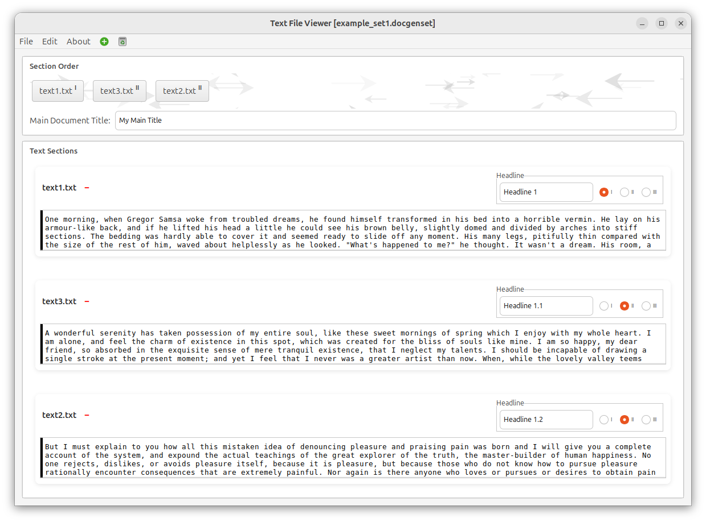

# DocGen - Document Generator

A GTK3-based document management application for creating and organizing text sections with drag-and-drop reordering and AsciiDoc export.



## Features

- **Section Management**: Create and manage multiple text sections with custom headers
- **Drag-and-Drop Reordering**: Intuitive section reordering with real-time visual feedback
- **Set Persistence**: Save and load section sets with all content and ordering
- **AsciiDoc Export**: Generate professional AsciiDoc documents from your sections
- **Clean UI**: Modern GTK3 interface with CSS styling

## Building

```bash
mkdir -p build
cd build
cmake ..
make -j$(nproc)
```

## Running

```bash
cd build
./docgen
```

## Usage

1. **Add Sections**: Edit → Add Text Section
2. **Reorder**: Drag section buttons in the order panel
3. **Save Set**: File → Save Set (saves as `.txt` file)
4. **Load Set**: File → Open Set
5. **Export**: Edit → Create Doc (generates `.adoc` file)

## Testing

Build and run tests:

```bash
cd build
cmake ..
make tests
./tests
```

Or use CTest:

```bash
cd build
ctest
```

## Code Coverage

Generate coverage report:

```bash
# Clean build directory first
rm -rf build/*
cd build

# Configure with coverage
cmake -DCMAKE_BUILD_TYPE=Coverage ..

# Build
make

# Generate coverage report
make coverage
```

The HTML coverage report will be in `build/coverage/index.html`. Open it in a browser to view detailed coverage information.

## Project Structure

```
docgen/
├── CMakeLists.txt           # CMake configuration
├── src/                     # Source files
│   ├── main.cpp            # Application entry point
│   ├── main_window.cpp     # Main window and menu handling
│   ├── section_manager.cpp # Section management and drag-drop
│   ├── text_section.cpp    # Individual section widget
│   └── text_viewer.cpp     # Text display functionality
├── include/                 # Header files
│   ├── main_window.h
│   ├── section_manager.h
│   ├── text_section.h
│   └── text_viewer.h
├── tests/                   # Test files (Google Test)
│   └── test_main.cpp
├── examples/                # Example files
│   ├── *.txt               # Example section sets
│   └── *.adoc              # Generated documents (ignored)
├── build/                   # Build directory (ignored)
└── README.md
```

## Dependencies

- GTK+ 3.0 (libgtk-3-dev)
- C++17 compiler
- CMake 3.10+
- Google Test (automatically fetched)
