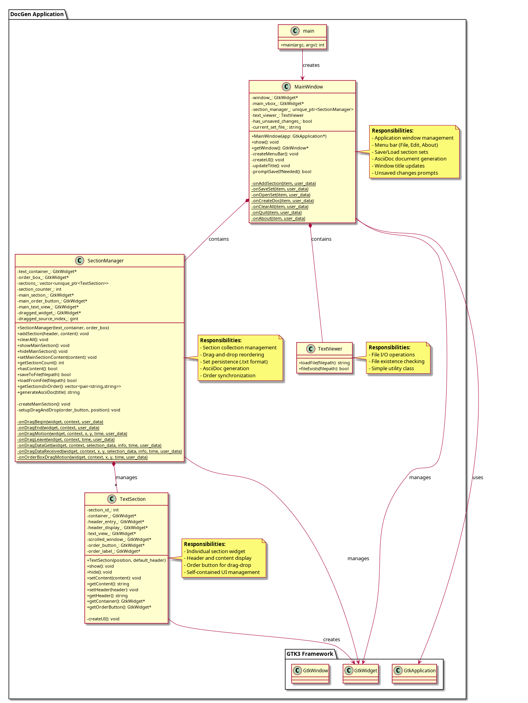

# DocGen Architecture Documentation

## Overview
DocGen is a GTK3-based document management application with a clean, object-oriented design following modern C++ best practices. It provides section management with customizable headlines and levels, drag-and-drop reordering, set persistence with metadata, individual section deletion, and AsciiDoc export with proper heading hierarchy.

## Class Structure

### 1. **MainWindow** (`include/main_window.h`, `src/main_window.cpp`)
**Responsibility:** Main application window and UI coordination

**Key Features:**
- Manages the GTK application window and menu system
- Creates and manages menu bar (File, Edit, About) with icon buttons (+ and trash)
- Handles document title input field for main document title
- Handles save/load of section sets (.docgenset format with metadata)
- Manages AsciiDoc document generation with heading hierarchy
- Window title updates to show current set file
- Prompts for unsaved changes
- Watermarked background in section order area
- Compact UI design with reduced spacing

**Key Methods:**
- `MainWindow(GtkApplication* app)` - Constructor, initializes window and UI
- `show()` - Displays the window
- `getDocumentTitle()` - Returns document title (with "Default title" fallback)
- `createMenuBar()` - Creates File/Edit/About menus with icon buttons
- `createUI()` - Sets up order box, text container, CSS styling, and watermark
- `updateTitle()` - Updates window title with current set name
- `promptSaveIfNeeded()` - Checks for unsaved changes
- Static callbacks: `onAddSection()`, `onSaveSet()`, `onOpenSet()`, `onCreateDoc()`, `onClearAll()`, `onQuit()`, `onAbout()`

**Design Pattern:** Facade pattern - provides simplified interface to complex subsystems

---

### 2. **TextSection** (`include/text_section.h`, `src/text_section.cpp`)
**Responsibility:** Encapsulates individual text section with header, headline, content, and deletion

**Key Features:**
- Self-contained section with header label (filename), headline input, and text view
- Customizable headline with 3 levels (I, II, III) via radio buttons
- Delete button (red minus sign) positioned next to filename
- Manages its own GTK widgets (container, delete_button, header_label, text_view, scrolled_window, radio buttons, headline_entry)
- Includes corresponding order button with level indicator for drag-drop ordering
- Automatic level indicator update on radio button change
- Reference to parent SectionManager for deletion callback
- Compact design with reduced margins and font sizes

**Key Methods:**
- `TextSection(int position, const std::string& default_header)` - Creates section with position ID
- `setContent(const std::string& content)` - Sets text content
- `setHeader(const std::string& header)` - Updates internal header text and labels
- `setHeadline(const std::string& headline)` - Sets headline text
- `setHeadlineLevel(int level)` - Sets level (1-3) and updates radio buttons
- `setManager(SectionManager* manager)` - Sets parent manager reference
- `getHeadline()` / `getHeadlineLevel()` - Retrieve headline data
- `show()` / `hide()` - Visibility control
- `getContainer()` / `getOrderButton()` - Access to GTK widgets
- Static callbacks: `onRadioChanged()`, `onDeleteClicked()`
- `updateLevelIndicator()` - Updates I/II/III label on order button

**Design Pattern:** Encapsulation - all section-related UI and state in one class

---

### 3. **SectionManager** (`include/section_manager.h`, `src/section_manager.cpp`)
**Responsibility:** Manages collection of text sections, drag-drop ordering, and document metadata

**Key Features:**
- Maintains vector of TextSection objects using smart pointers
- Handles main section (special section for primary file content)
- Implements real-time drag-and-drop reordering with visual feedback
- Synchronizes order box and text container during reordering
- Save/Load section sets with headlines, levels, and document title (.docgenset format)
- Individual section deletion on request from TextSection
- Stores loaded document title for restoration
- Generates AsciiDoc documents with proper heading hierarchy (==, ===, ====)

**Key Methods:**
- `SectionManager(GtkWidget* text_container, GtkWidget* order_box)` - Initializes manager
- `addSection(const std::string& header, const std::string& content)` - Creates new section and sets manager reference
- `deleteSection(TextSection* section)` - Removes specific section from collection
- `clearAll()` - Removes all sections and resets state
- `saveToFile(const std::string& filepath)` - Saves sections with [HEADLINE:] and [LEVEL:] metadata
- `loadFromFile(const std::string& filepath)` - Loads sections with metadata, stores document title
- `getLoadedDocumentTitle()` - Returns document title from loaded file
- `generateAsciiDoc(const std::string& title)` - Creates AsciiDoc with heading hierarchy
- `getSectionsInOrder()` - Returns sections in display order
- `setupDragAndDrop()` - Configures drag-drop for order buttons
- Static drag-drop callbacks: `onDragBegin()`, `onDragEnd()`, `onDragMotion()`, `onDragLeave()`, `onOrderBoxDragMotion()`

**Design Pattern:** Manager/Collection pattern - centralized control of related objects

---

### 4. **TextViewer** (`include/text_viewer.h`, `src/text_viewer.cpp`)
**Responsibility:** File I/O operations

**Key Features:**
- Simple utility class for loading text files
- File existence checking
- Exception-based error handling

**Key Methods:**
- `loadFile(const std::string& filepath)` - Reads and returns file content
- `fileExists(const std::string& filepath)` - Checks if file exists

**Design Pattern:** Utility class - stateless helper for file operations

---

## File Structure

```
docgen/
├── include/
│   ├── main_window.h       # MainWindow class interface
│   ├── text_section.h      # TextSection class interface
│   ├── section_manager.h   # SectionManager class interface
│   └── text_viewer.h       # TextViewer class interface
├── src/
│   ├── main.cpp            # Application entry point (minimal)
│   ├── main_window.cpp     # MainWindow implementation
│   ├── text_section.cpp    # TextSection implementation
│   ├── section_manager.cpp # SectionManager implementation
│   ├── text_viewer.cpp     # TextViewer implementation
│   └── main_old.cpp        # Previous monolithic version (backup)
├── tests/
│   └── test_main.cpp       # Unit tests for TextViewer
└── CMakeLists.txt          # Build configuration

```

## Dependency Graph

```
main.cpp
  └── MainWindow
      ├── SectionManager
      │   └── TextSection (multiple instances)
      └── TextViewer
```



## Key Design Improvements

### 1. **Separation of Concerns**
- UI logic (MainWindow) separated from business logic (SectionManager)
- Each section is self-contained (TextSection)
- File operations isolated (TextViewer)

### 2. **Memory Management**
- Smart pointers (`std::unique_ptr`) for automatic cleanup
- RAII principles - resources tied to object lifetime
- No manual memory management needed

### 3. **Encapsulation**
- Private members with public interfaces
- Implementation details hidden
- GTK widget lifecycle managed internally

### 4. **Maintainability**
- Single Responsibility Principle - each class has one clear purpose
- Easy to locate and modify specific functionality
- Reduced coupling between components

### 5. **Testability**
- Business logic (TextViewer) easily unit tested
- Clear interfaces make mocking possible
- Existing tests remain functional

## GTK Integration

The code maintains clean separation while working with C-style GTK:
- Static callback functions bridge GTK C API to C++ methods
- User data pointers pass `this` to callbacks
- `g_object_set_data()` stores context where needed

## Building

```bash
cd build
cmake ..
make
./docgen
```

## Running Tests

```bash
cd build
./tests
```

All 28 unit tests pass successfully, covering:
- TextViewer file operations (3 tests)
- TextSection functionality (7 tests)
- SectionManager operations (18 tests)

## Features

### Document Management
- Main document title input with persistence
- Default title ("Default title") when empty
- Title included in AsciiDoc export as level 0 heading (=)

### Section Management
- Add sections with custom headers (filename-based)
- Each section has customizable headline text
- 3 headline levels (I, II, III) corresponding to AsciiDoc levels (==, ===, ====)
- Radio button selection for level with visual indicator on order button
- Delete individual sections via red minus button
- Edit section content in read-only view mode
- Clear all sections (including document title)
- Compact UI with reduced font sizes and spacing

### Drag-and-Drop Ordering
- Real-time reordering of sections
- Visual feedback during drag operations
- Position determined by mouse position (left/right half)
- Synchronized order box and text display
- Level indicators (I/II/III) visible during drag

### Set Persistence
- Save section sets to .docgenset files
- Load existing section sets with full metadata restoration
- Format preserves: document title, section headers, headlines, levels, content
- Custom format: `[DOCUMENT_TITLE:]`, `[SECTION:]`, `[HEADLINE:]`, `[LEVEL:]`, `[END_SECTION]`
- Preserves content and ordering

### AsciiDoc Export
- Generates properly structured AsciiDoc documents
- Document title as level 0 (=)
- Section headlines as levels 1-3 (==, ===, ====)
- Uses custom headline text or defaults to "section headline"
- Replaces .docgenset extension with .adoc in suggested filename

### Visual Design
- Watermarked background in section order area
- Icon buttons (+ for add, trash for clear all) in menu bar
- CSS-styled components with modern appearance
- Compact design for efficient screen space usage

### AsciiDoc Export
- Generate AsciiDoc documents from sections
- Automatic filename suggestion (.adoc extension)
- Document title from set filename
- Proper AsciiDoc formatting (= title, == sections)
- File overwrite confirmation
